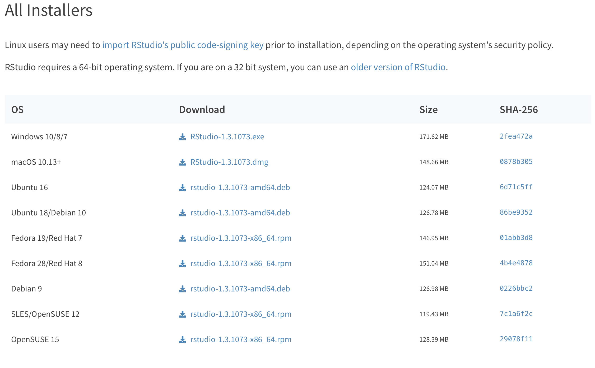
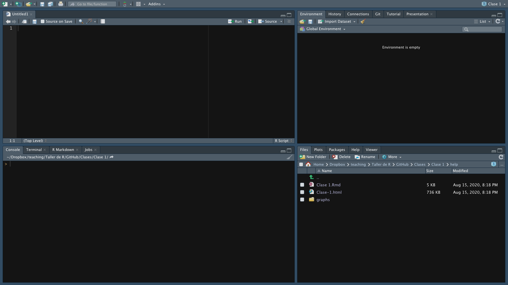
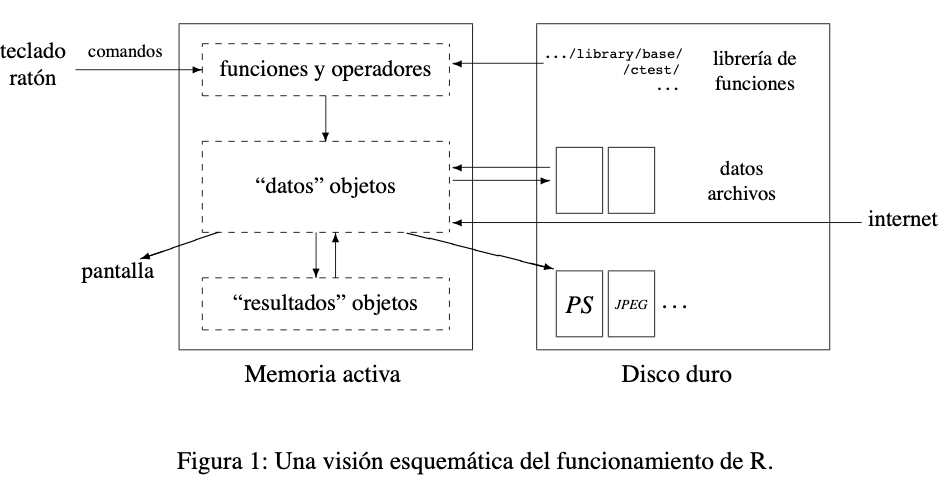

# Qué es y qué no es este curso.

* Este no es un curso dedicado a hacer econometría usando R. A lo largo del curso empleamos distintos conceptos estadísticos, pero la econometría no es el core del curso.  

* Este no es un curso avanzado de R. Desde las primeras las clases, el curso está pensado para personas que nunca han tenido contacto con la programacion. 

* Este curso está diseñado para introducir a los usuarios en métodos computacionales para la investigación económica.

* Vamos a trabajar desde la cuenta de GitHub del curso [https://github.com/taller-R](https://github.com/taller-R/). Ver el vídeo de ***Introducción del curso parte 1*** [aquí](https://www.dropbox.com/sh/wsa52fb66ey8irm/AADt86NnPK5F-t_oaUjV1zKea?dl=0). 

* Para replicar las clases del curso, debe ver el vídeo de ***Introducción del curso parte 2*** [aquí](https://www.dropbox.com/sh/wsa52fb66ey8irm/AADt86NnPK5F-t_oaUjV1zKea?dl=0).

* Ir al programa del curso [https://github.com/taller-R/readme](https://github.com/taller-R/readme).

# Instalar R

Independientemente del sistema operativo (Mac, Windows, Linux) es importante que todos trabajemos sobre la versión 3.6.3. de R. Trabajar en una versión más nueva o más antigua podría causar conflictos de compatibilidad, ya que las clases están preparadas sobre la versión 3.6.3.  

* Los instaladores de R los consiguen aquí:

  1.	Mac : https://cran.r-project.org/bin/macosx/
  2.	Windows : https://cran.r-project.org/bin/windows/base/old/
  3.	Linux : https://cran.r-project.org

# Instalar Rstudio

RStudio es un entorno de desarrollo integrado (IDE) para el lenguaje de programación R. En un lenguaje más practico, Rstudio brinda una interfaz más amigable que R, brindando una experiencia de aprendizaje más placentera. 

Para instalar la versión de Rstudio compatible con su sistema operativo, vaya al siguiente enlace  https://www.rstudio.com/products/rstudio/download/ 



Descargue el instalador de Rstudio que es compatible con su equipo.

# ¿Que es R? 

R es un entorno de programacion libre que se utiliza para el procesamiento y analisis estadistico de datos. Fue desarrollado en el año 1993 por Robert Gentleman y Ross Ihaka del Departamento de Estadística de la Universidad de Auckland, pero  actualmente R es responsabilidad del R Development Core Team.

### 1.0 ¿Por qué usar R?

* ¡Open Source!: R es un trabajo colaborativo y tiene mas de 6.000 paquetes disponibles que han sido desarrollados por una amplia comunidad de colaboradores de R. R es código abierto, entonces usted puede descargarlo, instalarlo y usarlo donde y cuando lo desee.


# 2.0 ¿Por qué usar R?

* ¡Somos muchos!: Es uno de los software estadisticos mas utilizado en las universidades del mundo.


Tomado de: https://www.datasciencecentral.com/profiles/blogs/nbv

* ¡Compatible!: Es compatible con equipos Mac, Windows y Linux.

# 1.0 Desventajas de R

* ¡Un reto!: En un principio el aprendizaje puede ser lento si con anterioridad no se ha tenido experiencia en otro lenguaje de programación.  


Tomado de: https://co.pinterest.com/pin/421297740137117532/

# 2.0 Desventajas de R

* Pero depende de tu dedicación.  


* R puede no ser eficiente para mover grandes volumenes de datos (se requiere la ayuda de herramientas como Hadoop y Spark).

# Interfaz de Rstudio

**1.** Consola. **2.** Editor de sintaxis **3.** Entorno de trabajo **4.** Varias pestañas (files,packages,help,plot)



(Vamos a cambiar la apariencia.)

# Intuicion del funcionamiento de R



Tomado de: Libro R para principiantes de Emmanuel Paradis. Consultar [aquí](https://cran.r-project.org/doc/contrib/rdebuts_es.pdf).

# ¡Ayuda! 


# No entiendo la función

Para pedir mayor informacion de una función o paquete en R, se antecede al nombre de la función o paquete el signo '?' 

```
?subset
?base
```

* 1. R-Bloggers
https://www.r-bloggers.com/5-ways-to-get-help-in-r/

* 2. Stackoverflow
https://stackoverflow.com

* 3. Rpubs https://rpubs.com


# 5. Vamos a Rstudio ... 


