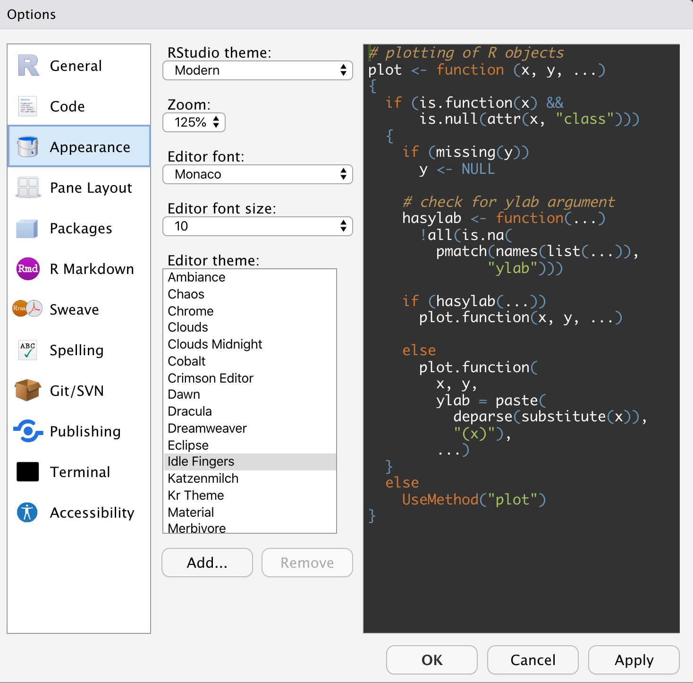

##### Elaborado por: Eduard F. Martínez-González.
##### Fecha: 12-08-2020. 
##### Notas: Para evitar conflictos entre los diferentes sistema operativos, no se usan acentos ni caracteres especiales a lo largo de este documento.


# 0. Antes de iniciar la clase ...

* Qué es y qué no es este curso.
* Discutir el programa. 
* Doodle horario de atención.
* Definir notas.

# 1. Configuracion inicial

1. Instalar R
https://cran.r-project.org    

2. Instalar R-Studio
https://www.rstudio.com/products/rstudio/download/

# 2. Acerca de R 

### ¿Que es R? 

R es un entorno de programacion libre que se utiliza para el procesamiento y analisis estadistico de datos. Fue desarrollado en el año 1993 por Robert Gentleman y Ross Ihaka del Departamento de Estadística de la Universidad de Auckland, pero  actualmente R es responsabilidad del R Development Core Team.


```{r, include=T}
# Escribir sobre concola para conocer quíenes contribuyen y/o han contribuido en el desarrollo de R
contributors()
```
 
### ¿Por qué usar R?

* ¡Open Source!: R es libre y facilmente accesible. Puede descargarlo, instalarlo y usarlo donde y cuando lo desee. Ademas, R tiene mas de 6.000 paquetes disponibles que han sido desarrollados por amplia comunidad de colaboradores de R.


* ¡Somos muchos!: Es uno de los software estadisticos mas utilizado en las universidades del mundo.


Tomado de: https://www.datasciencecentral.com/profiles/blogs/nbv

* ¡Poderoso!: Posee excelentes capacidades para procesar y analizar grandes volumenes de datos con 
* ¡Compatible!: Es compatible con equipos Mac, Windows y Linux.

### Desventajas de R

* ¡Un reto!: En un principio el aprendizaje puede ser lento si con anterioridad no se ha tenido experiencia en otro lenguaje de programación.  


Tomado de: https://co.pinterest.com/pin/421297740137117532/

* Pero depende de tu dedicación.  


* R puede no ser eficiente para mover grandes volumenes de datos (se requiere la ayuda de herramientas como Hadoop y Spark).

# 3. Interfaz de Rstudio

### Ventanas

* Consola
* Editor de sintaxis
* Entorno de trabajo
* Varias pestañas (files,packages,help,plot)

### Apariencia 



### Funcionamiento


Tomado de: Libro R para principiantes de Emmanuel Paradis.


# 4. ¡Ayuda! 


### No entiendo la función, 

Para pedir mayor informacion de una función o paquete en R, se antecede al nombre de la función o paquete el signo '?' 

```
?subset
?base
```

* 1. R-Bloggers
https://www.r-bloggers.com/5-ways-to-get-help-in-r/

* 2. Stackoverflow
https://stackoverflow.com

* 3. Rpubs https://rpubs.com


# 5. Vamos a la consola de Rstudio ... 


